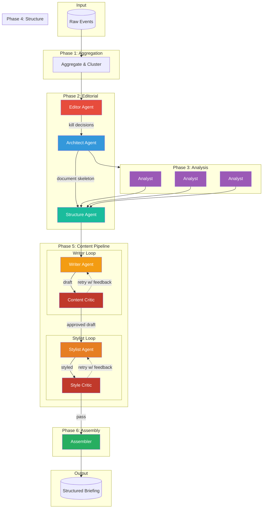

# The Briefing

**A multi-agent editorial pipeline that transforms raw event data into structured intelligence briefings.**

---

## What It Does

Transforms raw event streams into structured intelligence analysis:

```
Raw Events → Editorial Pipeline → Structured Briefing
(n events)    (8 phases, 8 agents)   (markdown output)
```

---

## Key Features

### 🎯 Editorial Kill Authority
- **PIC Matrix** scoring (Probability × Impact × Confidence)
- Filters low-signal stories automatically
- "Does this change the 6-month forecast?" heuristic

### 🏗️ Hub-Spoke Organization
- Identifies thematic "hub mechanism" across events
- Organizes "spokes" by how mechanism manifests regionally
- Generates causal transitions between sections

### ✍️ Multi-Agent Prose Generation
- **Chain of Density**: Iterative information compression
- **Chain of Verification**: Hallucination detection via ContentCritic
- **Dual Critic System**: ContentCritic (facts) + StyleCritic (prose quality)
- **Stylist Agent**: Voice transformation with sacred element preservation
- **Orwell Filter**: Post-processing for clarity

### 📊 Transparent Methodology
- Full audit trail of every decision
- Sherman Kent probability language (HIGHLY LIKELY 80-92%, etc.)
- Source citations for all claims
- Competing hypotheses evaluated

---

## Architecture



### Agent Roles

| Agent | Role |
|-------|------|
| **Editor** | Research context, apply PIC Matrix, make kill/publish decisions |
| **Architect** | Create document skeleton, define narrative arc, assign word budgets |
| **Analyst** | Deep-dive analysis using Constraints-of-Thought, Futures Wheel, ACH |
| **Structure** | Generate beat sheets and paragraph plans per archetype |
| **Writer** | Chain of Density prose generation with sacred element preservation |
| **ContentCritic** | Fact-checking, CoVe hallucination detection, source coverage (Writer loop) |
| **Stylist** | Voice transformation (Economist/Stratfor style) |
| **StyleCritic** | Prose quality, sentence variety, content preservation check (Stylist loop) |
| **Assembler** | Final document assembly with transitions |

**State Management:** Shared `PipelineState` dataclass mutated by all agents.

**Orchestration:** Async execution with checkpointing and retry logic.

---

## Quick Start

### Prerequisites

- Python 3.11 or higher
- A Gemini API key ([get one here](https://ai.google.dev/))

### Installation

```bash
# Clone the repository
git clone https://github.com/iamjameskeane/the-briefing.git
cd the-briefing

# Create and activate virtual environment
python -m venv venv
source venv/bin/activate  # On Windows: venv\Scripts\activate

# Install dependencies
pip install -r requirements.txt
```

### Configuration

Set your API key:

```bash
export GEMINI_API_KEY="your-api-key-here"
```

Or create a `.env` file (see `env.example` for template).

### Running Your First Briefing

The pipeline processes events from a data source. To test with sample data:

```python
import asyncio
from run import run_pipeline

# Run the pipeline
result = asyncio.run(run_pipeline(mode="test", dry_run=True))
```

The output will be saved to `outputs/` as a markdown file.

### Using Your Own Data

To use your own event data, you'll need to:

1. Set up an R2/S3-compatible storage bucket with your events
2. Configure R2 environment variables (see `env.example`)
3. Format events according to the schema in `sample_events.json`

Each event should have:
- `id`: Unique identifier
- `title`: Event headline
- `summary`: Detailed description
- `severity`: 0-10 score
- `region`: Geographic region
- `category`: Event type
- `timestamp`: ISO 8601 datetime
- `sources`: Array of source objects

### Configuration Options

#### Model Tier

```bash
# Use faster models for testing
export BRIEFING_MODE=test

# Use premium models for production
export BRIEFING_MODE=production
```

#### Custom Models

```bash
export BRIEFING_ANALYST_MODEL=gemini-3-flash-preview
export BRIEFING_WRITER_MODEL=gemini-3-pro-preview
```

See `config.py` for all available options.

### Testing

Run the test suite:

```bash
pytest
```

Run a specific test:

```bash
pytest tests/test_agents.py -v
```

---

## Example Output

**Narrative Arc:**
> "The global order is being liquidated: alliances are now subscriptions, and peace is a commodity."

**Section Structure:**
```markdown
## 🎯 The Hub: Transactionalism as the New Global Operating System

### Spoke 1 (Featured): The Greenland Gambit

Geography dictates the new American ledger...

### Spoke 2: Operation Absolute Resolve

If the Venezuelan intervention demonstrates the administration's 
appetite for decisive action, the situation in Iran reveals the 
limits of that model when faced with internal collapse...
```

---

## Use Cases

### Out of the Box
- **Geopolitical intelligence** (original use case)
- **Market analysis**
- **Academic research synthesis**
- **Legal case summaries**

### With Configuration
- **Financial briefings** (earnings, filings, market events)
- **Tech industry analysis** (product launches, M&A, policy)
- **Scientific literature reviews**
- Any domain requiring synthesis of multiple sources into structured analysis

---

## Contributing

This project is open source (MIT License). Contributions welcome!

**Areas for contribution:**
- **Prompt improvements:** Better prompts improve output quality
- **New voice modes:** Add your own stylistic transformations
- **Domain adaptations:** Adapt for finance, tech, science, etc.
- **Bug fixes:** Especially edge cases in orchestration

**How to contribute:**
1. Fork the repository
2. Create a feature branch
3. Make your changes with tests
4. Submit a pull request

---

## Philosophy

**Transparency as Product:**
- Not trying to hide that it's AI-generated
- Show the full decision process
- Admit blind spots and uncertainty
- Provide full audit trail

**Human Taste + Machine Scale:**
- The code can be replicated
- The editorial judgment is learned through iteration
- The example bank is curated by humans
- The system amplifies taste, doesn't replace it

---

## Limitations

**What it's designed for:**
- Synthesizing multiple sources
- Finding thematic connections
- Generating structured prose
- Maintaining consistent voice

**What it's not designed for:**
- Primary reporting (requires human sources)
- Investigative journalism
- Real-time breaking news
- Visual/multimedia production

**Data quality dependency:** Output quality is bounded by input event quality.

---

## Roadmap

- [ ] Real-time streaming mode (vs batch)
- [ ] Multi-language support
- [ ] Custom style training (fine-tune on your examples)
- [ ] Visual output (charts, maps, infographics)
- [ ] Collaborative editing interface
- [ ] Enterprise deployment guide

---

## Common Issues

### "GEMINI_API_KEY not set"
Make sure you've exported the environment variable or created a `.env` file.

### "Module not found"
Ensure you're in the project directory and have activated your virtual environment.

### Pipeline times out
For large event sets (100+ events), increase timeout limits in `config.py` or use test mode.

### No events found in R2
If you're not using R2 storage, modify `aggregate.py` to load from your own data source.

---

## Credits

**Built by:** [@iamjameskeane](https://github.com/iamjameskeane)

**Powered by:** Gemini (Google AI)

**Inspired by:** The Economist, Stratfor

---

## License

MIT License - see `LICENSE` file.

---

## Documentation

- **Agent Interfaces** - See `agents/schemas.py` for Pydantic models
- **Configuration** - See `config.py` for all tunable parameters
- **Examples** - See `examples/` for style transformation pairs
- **Dual Critic Architecture** - See `plans/writer_stylist_critic_refactor.md` for detailed design

---

## Questions?

- **Issues:** Use GitHub issues for bugs/features
- **Discussions:** GitHub Discussions for questions
- **Twitter/X:** [@iamjameskeane](https://twitter.com/iamjameskeane)

---

*Open sourced for the community.*
